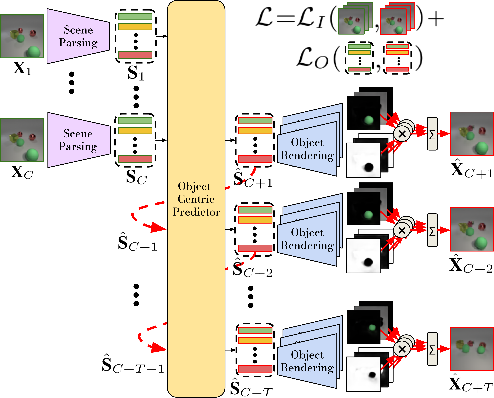
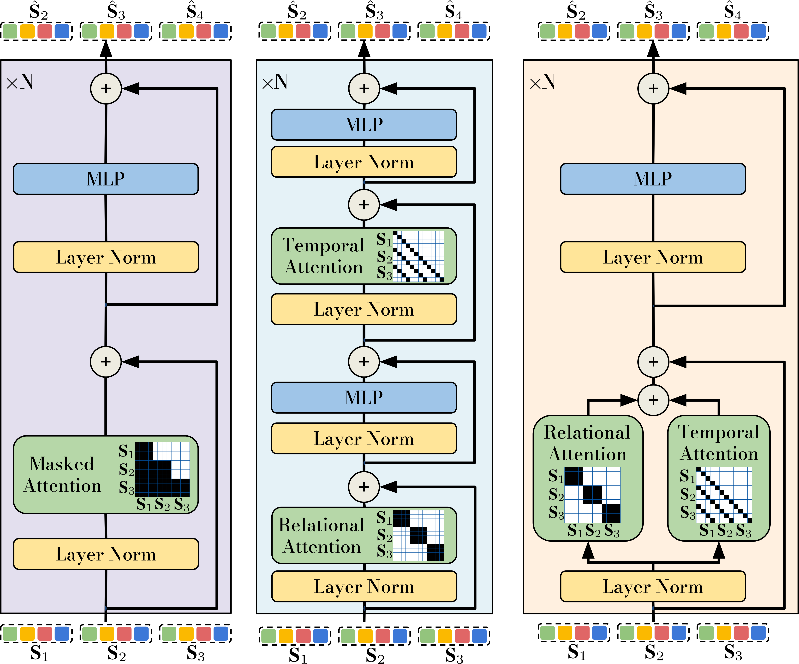
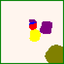
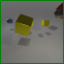

# Object-Centric Video Prediction via Decoupling <br> of Object Dynamics and Interactions


<p float="left">
  
  &nbsp;&nbsp; &nbsp;
  
</p>






Official implementation of:  **Object-Centric Video Prediction via Decoupling of Object Dynamics and Interactions** by Villar-Corrales et al. ICIP 2023. [[Paper](http://www.angelvillarcorrales.com/templates/others/Publications/2023_ObjectCentricVideoPrediction_ICIP.pdf)] [[Project Page](https://sites.google.com/view/ocvp-vp)]


## Installation

We refer to [docs/INSTALL.md](https://github.com/AIS-Bonn/OCVP-object-centric-video-prediction/blob/master/assets/docs/INSTALL.md) for detailed installation and preparation instructions.


## Training

We refer to [docs/TRAIN.md](https://github.com/AIS-Bonn/OCVP-object-centric-video-prediction/blob/master/assets/docs/TRAIN.md) for detailed instructions for training your own Object-Centric Video Decomposition model. Additonally, we report the required training time for both the SAVi scene decomposition, as well as the OCVP-Seq predictor module.


## Evaluation and Figure Generation

To reproduce the results provided in our paper, you can download our pretrained models, including checkpoints for the SAVi decomposition and prediction modules, by running the `download_pretrained` bash script:

```
chmod +x download_pretrained.sh
./download_pretrained.sh
```

### Evaluate SAVi for Image Decomposition

You can evaluate a SAVi video decomposition model using the `src/03_evaluate_savi_noMasks.py` and `src/03_evaluate_savi.py` scripts. The former measures the quality of the reconstructed frames, whereas the latter measures the fidelity of the object masks.

**Example:**
```
python src/03_evaluate_savi_noMasks.py \
  -d experiments/MOViA/ \
  --checkpoint savi_movia.pth

python src/03_evaluate_savi.py \
  -d experiments/MOViA/ \
  --checkpoint savi_movia.pth
```

### Evaluate Object-Centric Video Prediction

To evaluate an object-centric video predictor module (i.e. LSTM, Transformer, OCVP-Seq or OCVP-Par), you can use the `src/05_evaluate_predictor.py` script.


```
usage: 05_evaluate_predictor.py [-h] -d EXP_DIRECTORY -m SAVI_MODEL --name_predictor_experiment NAME_PREDICTOR_EXPERIMENT --checkpoint CHECKPOINT [--num_preds NUM_PREDS]

arguments:
  -d EXP_DIRECTORY, --exp_directory EXP_DIRECTORY
                        Path to the father exp. directory
  -m SAVI_MODEL, --savi_model SAVI_MODEL
                        Name of the SAVi checkpoint to load
  --name_predictor_experiment NAME_PREDICTOR_EXPERIMENT
                        Name to the directory inside the exp_directory corresponding to a predictor experiment.
  --checkpoint CHECKPOINT
                        Checkpoint with predictor pre-trained parameters to load for evaluation
  --num_preds NUM_PREDS
                        Number of rollout frames to predict for
```

**Example 1:** Reproduce LSTM predictor results on the Obj3D dataset:
```
python src/05_evaluate_predictor.py \
  -d experiments/Obj3D/ \
  --savi_model savi_obj3d.pth \
  --name_predictor_experiment Predictor_LSTM \
  --checkpoint lstm_obj3d.pth \
  --num_preds 25
```

**Example 2:** Reproduce OCVP-Seq predictor results on the MOVi-A dataset:
```
python src/05_evaluate_predictor.py \
  -d experiments/MOViA/ \
  --savi_model savi_movia.pth \
  --name_predictor_experiment Predictor_OCVPSeq \
  --checkpoint OCVPSeq_movia.pth \
  --num_preds 18
```

### Generate Figures and Animations

To generate video prediction, object prediction and segmentation figures and animations, you can use the
`src/06_generate_figs_pred.py` script.

**Example:**
```
python src/06_generate_figs_pred.py \
  -d experiments/Obj3D/ \
  --savi_model savi_obj3d.pth \
  --name_predictor_experiment Predictor_OCVPSeq \
  --checkpoint OCVPSeq_obj3d.pth \
  --num_seqs 10 \
  --num_preds 25
```


## Acknowledgement

Our work is inspired and uses resources from the following repositories:
 - [SAVi-pytorch](https://github.com/junkeun-yi/SAVi-pytorch)
 - [slot-attention-video](https://github.com/google-research/slot-attention-video/)
 - [G-SWM](https://github.com/zhixuan-lin/G-SWM)


## Contact and Citation

This repository is maintained by [Angel Villar-Corrales](http://angelvillarcorrales.com/templates/home.php).


Please consider citing our paper if you find our work or our repository helpful.

```
@inproceedings{villar_ObjectCentricVideoPrediction_2023,
  title={Object-Centric Video Prediction via Decoupling <br> of Object Dynamics and Interactions},
  author={Villar-Corrales, Angel and Wahdan, Ismail and Behnke, Sven},
  booktitle={Internation Conference on Image Processing (ICIP)},
  year={2023}
}
```

In case of any questions or problems regarding the project or repository, do not hesitate to contact the authors at villar@ais.uni-bonn.de.
